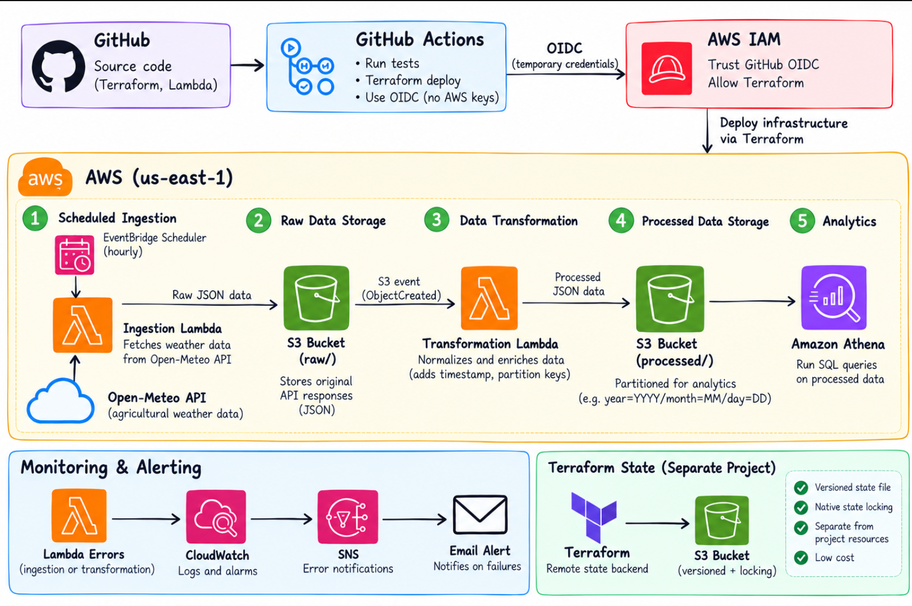

# AWS Agriculture Data Pipeline

A serverless, event-driven weather data pipeline built on AWS using **Python, Lambda, S3, EventBridge Scheduler, AWS Glue, Athena, CloudWatch, SNS, Terraform, and GitHub Actions**.

The project ingests weather observations for fictional agricultural sites from the Open-Meteo API, preserves the original API responses in an S3 raw layer, transforms the data into an analytics-friendly format, and makes the processed dataset queryable with Amazon Athena.

Infrastructure is managed with Terraform and deployed through GitHub Actions using **OIDC authentication instead of long-lived AWS access keys**.

---

## Architecture



### High-Level Flow

```text
EventBridge Scheduler
        ↓
Ingestion Lambda
        ↓
Open-Meteo API
        ↓
S3 raw/
        ↓
S3 ObjectCreated Event
        ↓
Transformation Lambda
        ↓
S3 processed/
        ↓
AWS Glue Data Catalog
        ↓
Amazon Athena
```

Supporting components provide:

- CloudWatch monitoring
- SNS email alerts
- GitHub Actions CI/CD
- GitHub → AWS OIDC authentication
- Terraform remote state in S3
- Native Terraform state locking

---

## What This Project Demonstrates

This project focuses on practical cloud engineering and DevOps concepts:

- Serverless AWS architecture
- Event-driven data processing
- Raw and processed data separation
- Python-based Lambda functions
- Infrastructure as Code with Terraform
- Remote Terraform state management
- CI/CD with GitHub Actions
- Keyless AWS authentication using OIDC
- Automated unit testing
- CloudWatch monitoring and alerting
- SQL analytics with Athena
- Idempotent data transformation
- S3 versioning for data traceability

---

## Data Pipeline

### 1. Scheduled Ingestion

Amazon EventBridge Scheduler invokes the ingestion Lambda on an hourly schedule.

The Lambda retrieves weather observations from the Open-Meteo API for three example agricultural locations:

- Indiana
- Iowa
- Oregon

The original API response is preserved before transformation.

---

### 2. Raw Data Storage

The ingestion Lambda writes the API response to the `raw/` prefix of the S3 data bucket.

Example:

```text
raw/
└── farm-indiana-001/
    └── 2026/
        └── 09/
            └── 28/
                └── 014950.json
```

Keeping raw data separate provides:

- source-data traceability
- easier troubleshooting
- ability to reprocess data
- separation between ingestion and analytics

---

### 3. Event-Driven Transformation

An S3 `ObjectCreated` event on the `raw/` prefix invokes the transformation Lambda.

The transformation function converts the nested Open-Meteo response into a normalized record such as:

```json
{
  "farm_id": "farm-indiana-001",
  "farm_name": "Indiana Farm",
  "source": "open-meteo",
  "ingested_at": "2026-09-28T01:49:50Z",
  "observation_time": "2026-09-28T01:45",
  "temperature_c": 21.5,
  "humidity_percent": 65,
  "precipitation_mm": 0.0,
  "wind_speed_kmh": 8.4
}
```

The normalized record is written to the `processed/` layer.

---

## Idempotent Processing

A key improvement made during development was preventing duplicate analytical records.

Originally, every ingestion execution generated a different processed S3 object even when the source weather observation was identical.

The transformation Lambda now derives the processed S3 key from:

```text
farm_id + observation_time
```

For example:

```text
processed/
└── farm-indiana-001/
    └── 2026/
        └── 09/
            └── 28/
                └── 20260928T0145.json
```

If the same observation is processed again, the Lambda writes to the same S3 key.

Because S3 versioning is enabled, previous writes remain available as object versions while only the latest version is exposed as the current object.

This makes retries and repeated ingestion idempotent at the processed-data layer.

The behavior was validated by executing ingestion twice for the same observation:

```text
Ingestion #1 ─┐
              ├──> same processed S3 key
Ingestion #2 ─┘
                     ↓
              S3 object versions
                     ↓
              one current object
                     ↓
                   Athena
                     ↓
          one analytical record
```

---

## Analytics

AWS Glue Data Catalog defines the schema for the processed weather dataset.

The schema is managed directly through Terraform rather than using a Glue crawler because the processed record structure is predictable.

Amazon Athena queries the processed JSON directly from S3.

Example:

```sql
SELECT
    farm_name,
    observation_time,
    temperature_c,
    humidity_percent,
    precipitation_mm,
    wind_speed_kmh
FROM agriculture_data.weather_observations
ORDER BY farm_name, observation_time DESC;
```

Athena was also used to validate idempotency:

```sql
SELECT
    farm_id,
    farm_name,
    observation_time,
    COUNT(*) AS record_count
FROM agriculture_data.weather_observations
WHERE observation_time = '2026-09-28T01:45'
GROUP BY
    farm_id,
    farm_name,
    observation_time
ORDER BY farm_id;
```

The test returned one current analytical record per farm.

---

## Monitoring and Alerting

Both Lambda functions are monitored using Amazon CloudWatch.

CloudWatch alarms monitor Lambda execution errors:

```text
Lambda Error
     ↓
CloudWatch Alarm
     ↓
Amazon SNS
     ↓
Email Notification
```

The alerting path was tested using a controlled CloudWatch alarm-state test.

Missing metric data is configured as `notBreaching` to avoid false alarms when the serverless functions are idle.

---

## Infrastructure as Code

Terraform manages the AWS infrastructure, including:

- S3 data storage
- Lambda functions
- Lambda IAM roles
- EventBridge Scheduler
- S3 event notifications
- AWS Glue database and table
- Athena workgroup
- CloudWatch alarms
- SNS notifications
- GitHub OIDC provider
- GitHub Actions IAM role

Terraform configuration is located in:

```text
terraform/
```

---

## Remote Terraform State

Terraform state is stored in a separate S3 backend created by the `bootstrap/` Terraform project.

```text
Terraform
    ↓
Separate S3 State Bucket
    ├── Versioning
    ├── Encryption
    └── Native state locking
```

The state infrastructure is intentionally separated from the application infrastructure so the main stack can be destroyed without deleting its own state backend.

---

## CI/CD

GitHub Actions provides infrastructure validation and controlled deployment.

### Continuous Integration

On pushes and pull requests, the CI workflow performs:

```text
Python Unit Tests
        ↓
Terraform Format Check
        ↓
GitHub OIDC Authentication
        ↓
Terraform Init
        ↓
Terraform Validate
        ↓
Terraform Plan
```

Terraform checks run only after the Python unit tests pass.

### Controlled Deployment

Infrastructure deployment uses a separate manually triggered GitHub Actions workflow.

```text
GitHub Actions
       ↓
OIDC
       ↓
AWS STS temporary credentials
       ↓
Terraform Init
       ↓
Terraform Plan
       ↓
Terraform Apply
```

The workflow uses `workflow_dispatch`, preventing an ordinary source-code push from automatically modifying AWS infrastructure.

Terraform concurrency controls and remote state locking help prevent simultaneous infrastructure modifications.

---

## Keyless AWS Authentication

GitHub Actions authenticates to AWS using OpenID Connect (OIDC).

```text
GitHub Actions
      ↓
GitHub OIDC Token
      ↓
AWS IAM Trust Policy
      ↓
AWS STS
      ↓
Temporary Credentials
```

No long-lived AWS access keys are stored in the repository or GitHub Actions secrets.

The IAM role provides the permissions required for Terraform to inspect and deploy the project infrastructure.

---

## Automated Tests

Transformation logic is tested using Python's built-in `unittest` framework.

Current tests verify:

- weather-record transformation
- deterministic processed-key generation
- idempotent key generation

Run locally:

```bash
python -m unittest discover -s tests -v
```

These tests are also executed automatically by GitHub Actions before Terraform validation and planning.

---

## Repository Structure

```text
aws-agriculture-data-pipeline/
│
├── .github/
│   └── workflows/
│       ├── aws-oidc-test.yml
│       ├── terraform-ci.yml
│       └── terraform-deploy.yml
│
├── bootstrap/
│   └── main.tf
│
├── diagrams/
│   └── architecture.png
│
├── src/
│   ├── ingestion/
│   │   └── handler.py
│   │
│   └── transformation/
│       └── handler.py
│
├── terraform/
│   ├── athena.tf
│   ├── backend.tf
│   ├── eventbridge.tf
│   ├── github_oidc.tf
│   ├── github_permissions.tf
│   ├── glue.tf
│   ├── iam.tf
│   ├── lambda.tf
│   ├── monitoring.tf
│   ├── outputs.tf
│   ├── providers.tf
│   ├── s3.tf
│   └── variables.tf
│
├── tests/
│   └── test_transformation.py
│
├── .gitignore
└── README.md
```

Generated Lambda ZIP files, Terraform working directories, local state files, Python virtual environments, test response files, and Python cache files are excluded from version control.

---

## Local Requirements

The project was developed with:

- Terraform 1.15.x
- AWS CLI v2
- Python
- boto3
- Git
- AWS SSO
- GitHub Actions

Authenticate locally using AWS SSO:

```bash
aws sso login --profile my-aws
```

Verify authentication:

```bash
aws sts get-caller-identity --profile my-aws
```

---

## Terraform Deployment

Initialize Terraform:

```bash
cd terraform

AWS_PROFILE=my-aws terraform init
```

Validate:

```bash
terraform fmt -check -recursive
terraform validate
```

Review changes:

```bash
AWS_PROFILE=my-aws terraform plan \
  -var="alert_email=YOUR_EMAIL"
```

Apply:

```bash
AWS_PROFILE=my-aws terraform apply \
  -var="alert_email=YOUR_EMAIL"
```

Do not commit personal email addresses, AWS credentials, Terraform state files, or other local configuration containing sensitive information.

---

## Destroying the Environment

The application infrastructure can be removed when it is not needed:

```bash
AWS_PROFILE=my-aws terraform destroy \
  -var="alert_email=YOUR_EMAIL"
```

S3 buckets must be empty before deletion. Versioned buckets require removal of object versions and delete markers.

The Athena workgroup may require recursive cleanup of query history before deletion.

The separate Terraform state backend under `bootstrap/` is intentionally retained so the project can be recreated later.

---

## Engineering Decisions

### Why Lambda?

The workload is small, scheduled, and event-driven. Lambda avoids maintaining continuously running compute resources.

### Why separate raw and processed data?

The raw layer preserves the source payload while the processed layer provides a stable analytics schema.

### Why S3 events?

Transformation starts only when new raw data arrives, keeping ingestion and transformation loosely coupled.

### Why no Glue ETL job?

The transformation is lightweight and fits naturally in Lambda. Glue Data Catalog is used for schema metadata while the actual transformation remains serverless.

### Why no VPC for Lambda?

The ingestion Lambda requires outbound access to the public Open-Meteo API. Keeping the Lambda outside a customer-managed VPC avoids unnecessary NAT Gateway complexity and cost for this workload.

### Why OIDC?

OIDC allows GitHub Actions to obtain temporary AWS credentials instead of storing long-lived AWS access keys.

### Why deterministic S3 keys?

Deterministic processed keys make repeated processing of the same farm observation idempotent while S3 versioning preserves write history.

---

## Lessons Learned

Building the project highlighted several practical cloud-engineering concerns beyond simply connecting AWS services:

- remote Terraform state must be designed separately from the resources it manages
- CI should test application logic before infrastructure deployment
- long-lived cloud credentials should be avoided where federation is available
- event-driven systems need to account for retries and duplicate events
- raw data should be preserved independently of transformed data
- monitoring should be tested rather than assumed to work
- infrastructure teardown needs to account for versioned S3 objects and service-specific dependencies

---

## Future Improvements

Potential extensions include:

- Parquet output for more efficient analytical queries
- S3 lifecycle policies for raw and historical data
- Lambda failure destinations or dead-letter handling
- stronger resource-level IAM restrictions
- additional unit and integration tests
- multiple environments such as dev and production
- automated deployment approvals
- dashboards for pipeline health and ingestion metrics

---

## Status

The project has been successfully built, tested, queried through Athena, deployed through GitHub Actions, and then destroyed to avoid unnecessary AWS costs.

The Terraform remote-state infrastructure is retained separately so the environment can be recreated when needed.